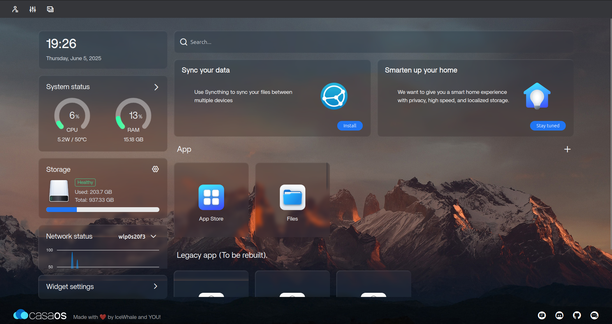
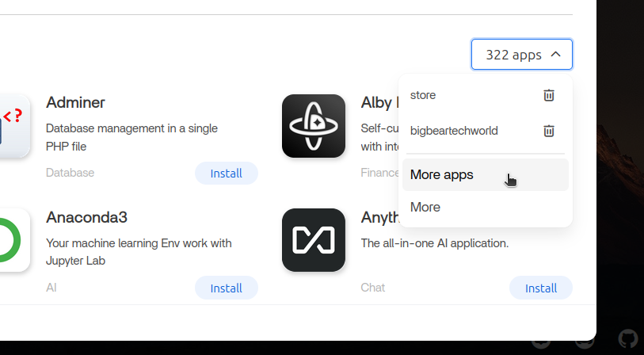
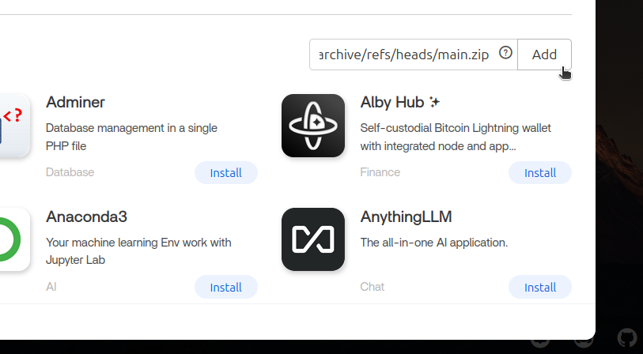

## Formicaio App Store for CasaOS

This repository contains community apps for [CasaOS](https://casaos.zimaspace.com/).

## How to use:

You need to copy the below source link and add it to your CasaOS settings to access the this app store:

    https://github.com/bochaco/formicaio-casaos-app-store/archive/refs/heads/main.zip

### Installation

- Go to your CasaOS dashboard.

  

- Open the appstore and click `apps` -> `More apps` button located on the right just above the apps list.

  

- Paste the appstore link `https://github.com/bochaco/formicaio-casaos-app-store/archive/refs/heads/main.zip` and then click `Add` to submit.

  

- Wait for the installation to finish. Done!

**NOTE: This app store is only supported on CasaOS version [0.4.4](https://blog.casaos.io/blog/32.html) and above.
